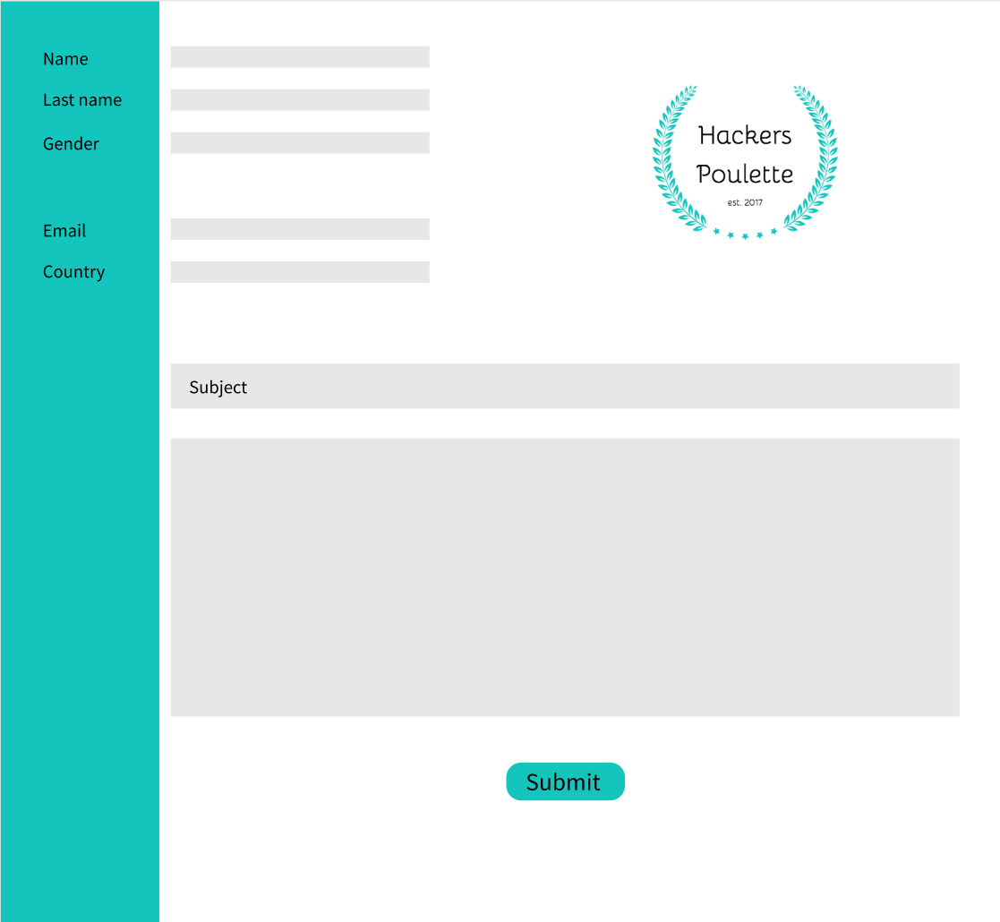
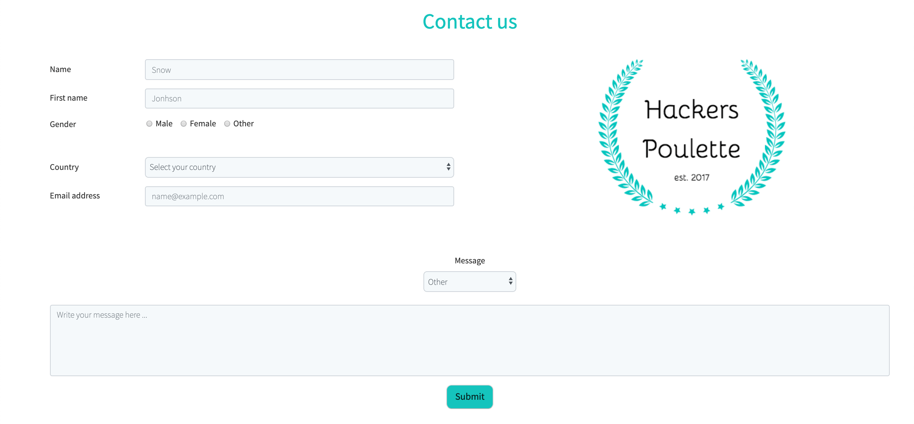

# hackers-poulette

Hackers poulette is a contact form created as an excercice to improve my PHP skills, I had 3 days to build it from scratch.
Here is the result : https://hackers-poulette420.herokuapp.com/

<h2>Mockup</h2>

<h2>Preview</h2>

<h2>Responsive</h2>
The website is responsive for mobile, tablet and desktop.

<h2> Build With </h2>
<ul>
    <li>HTML</li>
    <li>CSS</li>
    <li>SASS</li>
    <li>Boostrap</li>
    <li>PHP</li>
</ul>

<h2>Author</h2>
Matis Karamenderes
11/10/2019
